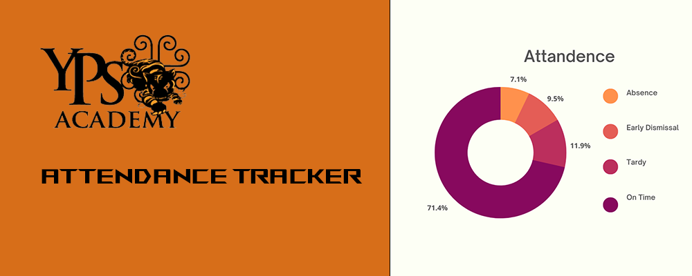

# StingersDownYPSA

CSC 190 Stingers Down Attendance Tracker

# About
YPSA Attendence Tracker is a app that tracks the attendance of the students and staff at YPSA Academy. It generates graphs to show how many students or staff members were late, got early dismissals or absence over the semester.

# Built With
* [![React][React.js]][React-url]
* [![Firebase][Firebase.js]][Firebase-url]
* [![Mui][Mui.js]][Mui-url]
* [![Figma][Figma.js]][Figma-url]
* [![Node.js][Node.js]][Node-url]


# Firebase
Firebase is a app development platform that helps build and grow apps. It is backed by Google and trusted by millions of businesses around the world. It is used in this project to host our project, creates the database for the student and staff information through the Firestore database.

# Features
### Current Features:
- Export data to CSV file
- Adding data from forms to the database 
- Authentication Login

### Future features to implement
- Deleting data from the database
- Form validation /  Form credibility 
- Generate graph trends from the data from the database

## Installation
Use NPM (recommended to use NVM to get NPM from here: [NVM])

Use the following code in project directory to install the firebase and firebase-cli modules:
```powershell
npm i firebase
npm i firebase-tools
npm i firebase-cli
```
You can use `-g` appended to the NPM command to install it globally.

## Setting up Firebase
The Firebase project should already be initialized but you need to sign in using:
```powershell
firebase login
```
You can use `firebase projects:list` to check if you are logged in correctly.

## Testing
The build must be updated after any code update before it can be viewed run:
```powershell
npm run build
```
You can view how what the project looks like before deploying by using the command:
```powershell
firebase serve
```
This will create a local server that you can access at `localhost:5000` by default. You can change the host or port using `--host x.x.x.x` or `--port x`. You can turn off the local server by pressing `ctrl`+`c`.

## Deploying
Deploying pushes the Firebase project to the hosting site and allows it to be accessed globally from the internet. Deploy it using:
```powershell
firebase deploy
```

[NVM]: https://github.com/coreybutler/nvm-windows
[React.js]: https://img.shields.io/badge/React-20232A?style=for-the-badge&logo=react&logoColor=61DAFB
[React-url]: https://reactjs.org/
[Firebase.js]: https://img.shields.io/badge/Firebase-FFFFFF?style=for-the-badge&logo=firebase&logoColor=FFCA28
[Firebase-url]: https://firebase.google.com/
[Mui.js]: https://img.shields.io/badge/Mui-FFFFFF?style=for-the-badge&logo=MUI&logoColor=007FFF
[Mui-url]: https://mui.com/
[Figma.js]: https://img.shields.io/badge/Figma-111111?style=for-the-badge&logo=Figma&logoColor=FFFFFF
[Figma-url]: https://www.figma.com
[Node.js]: https://img.shields.io/badge/Node.js-233056?style=for-the-badge&logo=Node.js&logoColor=689F63
[Node-url]: https://nodejs.org/en/

